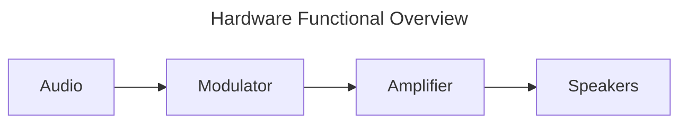

Parametric Speaker System
================================================================================

`Audio` signal in human hearing range.

`Modulator` encodes `audio` by varying a carrier wave's frequency in proportion to the message signal's amplitude, keeping amplitude constant but changing frequency to represent sound's pitch and loudness.

`Amplifier` powers the `Speaker(s)` per the modulated signal.

`Speaker(s)` are ultrasound transmitters, carrier wave > 20KHz.

Build of Materials
================================================================================
Speaker - ultrasound transmitter
--------------------------------------------------------------------------------
* [TCT40-16T/R](https://docs.sparkfun.com/SparkFun_Ultrasonic_Distance_Sensor-Qwiic/assets/component_documentation/TCT40-16-T-R.pdf)
    * Frequency - 40 KHz
    * Max Voltage - 80 V

Amplifier - modulated signal at higher voltage
--------------------------------------------------------------------------------
Higher voltage increases loudness - but too much voltage will destroy the speaker.

Amplifiers heat up as you transfer power through them.

* [L298N](https://www.google.com/url?sa=t&source=web&rct=j&opi=89978449&url=https://www.st.com/resource/en/datasheet/l298.pdf)
    * Max Voltage - 50 V
    * Current
        * max - 3 A
        * Typical - 2 A
    * Frequency
        * Typical - 20KHz
        * Max - 40KHz

Modulator and Audio SoC - (System On a Chip)
--------------------------------------------------------------------------------
This project leverages embedded SoC hardware to perform this function
(see specific target docs for more details).
* Most platforms provide a voltage regulator that supports voltages up to 10 V.

### ESP32
* Provides an APLL (Audio Phase-Locked Loop) to perform the modulation
* Supports BlueTooth, so the speaker can effectively be used like any other
    BlueTooth speaker (pairing, audio transfer).

Guidance
--------------------------------------------------------------------------------
If the voltage level of your amplifier vs SoC mismatch, you can use multiple
power sources coupled to a common ground.

Each amplifier can support multiple speakers in parallel. Each additional
speaker increases the current draw. The more current drawn, the hotter the
amplifier gets - if the amplifier gets too hot, it'll fail.

### For a demonstration project, I'm using
* (10) TCT40-16T [Amazon Source](https://www.amazon.com/hiBCTR-40PCS-TCT40-16R-Ultrasonic-Sensor/dp/B0FND34DNY/)
* (1) L298N [Amazon Source](https://www.amazon.com/JTAREA-L298N-Motor-Driver-H-Bridge/dp/B0D2RLY7GH)
* (1) ESP32-DevKitC [Amazon Source](https://www.amazon.com/HiLetgo-ESP-WROOM-32-Bluetooth-ESP32-DevKitC-32-Development/dp/B0CNYK7WT2/)

Which shouldn't pose a safety hazard as it's relatively low powered.