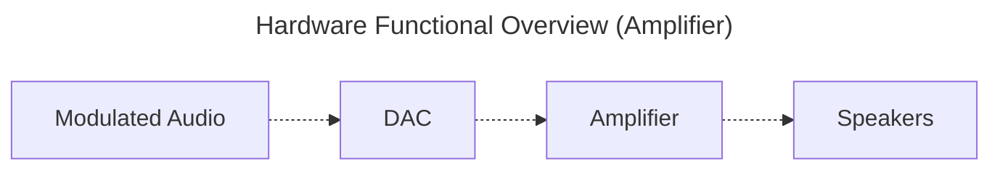
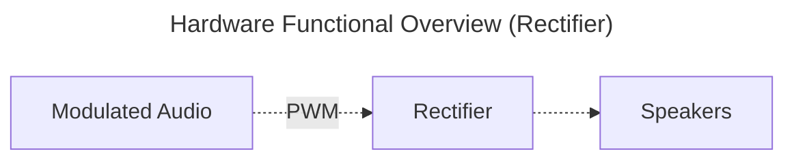

Parametric Speaker System
================================================================================

<!-- Amplifier Based Design
================================================================================

`Speakers` are ultrasound transmitters designed to transmit at 40 KHz (`carrier frequency`).

`Amplifiers` drive the speakers at a higher voltage (to increase loudness) per the analog
voltage input.

The `DAC` produces the voltages to drive analog voltage per the `Modulated Audio`. -->

Rectifier Based Design
================================================================================

`Speakers` are ultrasound transmitters designed to transmit at 40 KHz (`carrier frequency`).

The `Rectifier` drives the speakers at a higher voltage (to increase loudness).
`Rectifiers` are binary (on/off). The `Rectifier` input is a Pulse Width Modulation (`PWM`) signal operating at the `carrier frequency`.

Rectifier Guidance
--------------------------------------------------------------------------------
Not all rectifiers are designed to operate at ultrasound frequencies.

Make sure to choose a rectifier that is designed to operate at 40 KHz.

Example Bill of Materials (BOM)
================================================================================
[Cheap Parts](demo_recipe.md) - focus on low cost
